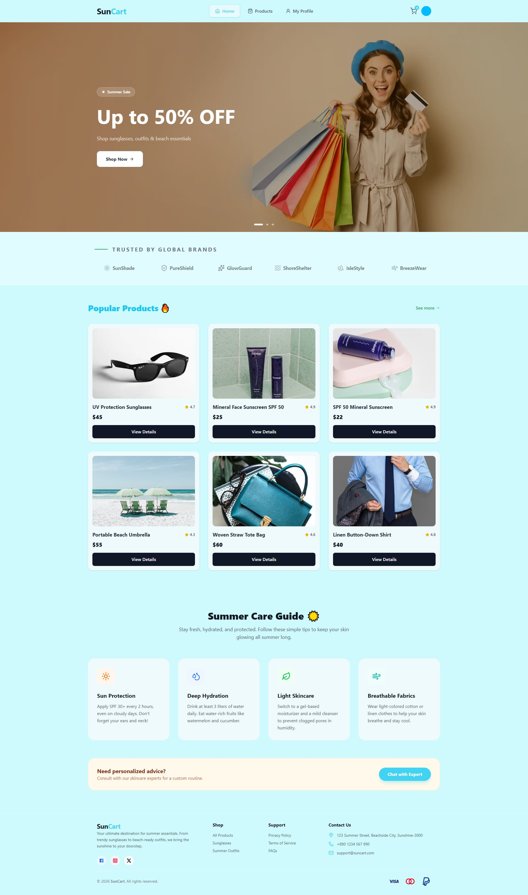

# ☀️ SunCart – Summer Essentials Store

**A modern summer eCommerce platform to explore and purchase seasonal products**
---
## 🌐 Live Demo & Repository

| 🚀 Live Site | 💻 GitHub Repo |
|---|---|
| [🔗 View Live](https://sun-cart-sage.vercel.app/) | [💻 View on GitHub](https://github.com/ziaulhoquepatwary/SunCart.git) |

---
## 📸 Screenshots

### 🏠 Home Page

---

## 📖 Project Overview

**SunCart** is a full-stack eCommerce web application built for summer shoppers. Users can browse a curated collection of summer essentials — sunglasses, beach accessories, skincare, and more — and place orders after authentication.

The platform features a clean, vibrant UI tailored to the summer season, complete with Google OAuth, protected routes, and a smooth shopping experience across all devices.

---

## ✨ Key Features

- 🏠 **Dynamic Home Page** — Hero banner with summer sale offers, popular products section, summer care tips, and top brand showcases
- 🛍️ **Product Catalog** — Browse 6+ summer products with image, name, rating, price, and category
- 🔒 **Protected Product Details** — Full product details page accessible only after login; redirects back after authentication
- 🔐 **Authentication with BetterAuth** — Email/password login & registration + Google OAuth (one-click social login)
- 👤 **My Profile Page** — View logged-in user's name, photo, and email
- ✏️ **Update Profile** — Update display name and profile photo via a dedicated form
- 🎨 **Unique Summer Design** — Custom UI with warm, seasonal color palette
- 📱 **Fully Responsive** — Optimized for mobile, tablet, and desktop
- 🔔 **Sweet Alert 2** — Beautiful toast/alert notifications for login, register, and error events
- 🌿 **Animation** — Smooth UI animations for enhanced user experience
- 🔑 **Environment Variables** — All sensitive config keys secured via `.env`

---

## 📄 Pages & Routes

| Route | Description | Protected |
|-------|-------------|-----------|
| `/` | Home page with hero, products, tips, brands | ❌ Public |
| `/products` | All summer products listing | ❌ Public |
| `/products/[id]` | Full product detail view | ✅ Login required |
| `/login` | Login with email or Google | ❌ Public |
| `/register` | Register with name, email, photo, password | ❌ Public |
| `/my-profile` | View logged-in user's profile | ✅ Login required |
| `/my-profile/update` | Update name and profile photo | ✅ Login required |

---

## 🛠️ Tech Stack

| Category | Technology |
|----------|-----------|
| **Framework** | [Next.js](https://nextjs.org/) (App Router) |
| **Styling** | [Tailwind CSS](https://tailwindcss.com/) |
| **Authentication** | [BetterAuth](https://better-auth.com/) |
| **Alerts & Toasts** | [SweetAlert2](https://sweetalert2.github.io/) |
| **Deployment** | [Vercel](https://vercel.com/) |

---

## 🚀 Getting Started Locally

```bash
# 1. Clone the repository
git clone https://github.com/ziaulhoquepatwary/SunCart.git

# 2. Navigate into the project
cd SunCart

# 3. Install dependencies
npm install

# 4. Set up environment variables
cp .env.example .env.local
# Fill in your keys (see below)

# 5. Run the development server
npm run dev
```

Open [http://localhost:3000](http://localhost:3000) in your browser.

---

## 🔐 Environment Variables

Create a `.env.local` file in the root directory with the following keys:

```env
# BetterAuth
BETTER_AUTH_SECRET=your_secret_key
BETTER_AUTH_URL=http://localhost:3000
MONGODB_URI=your_mongodb_connection_key

# Google OAuth
GOOGLE_CLIENT_ID=your_google_client_id
GOOGLE_CLIENT_SECRET=your_google_client_secret

```

> ⚠️ Never commit your `.env.local` file to GitHub. It is already listed in `.gitignore`.

---

## 👨‍💻 Author

**Ziaul Hoque Patwary**  
📧 Email: [**ziaul.dev@gmail.com**] 
🔗 GitHub: [ziaulhoquepatwary](https://github.com/ziaulhoquepatwary)
---